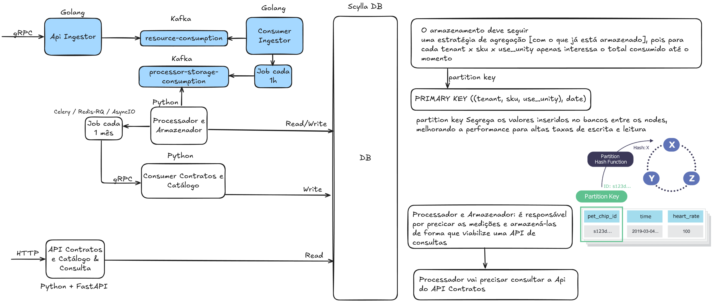

# Magalu Cloud Back-end Desafio

## Como Iniciar o Projeto

Para iniciar o projeto, execute: `make build && make compose`. O comando build é responsável por gerar a imagem dos serviços ingestor_api e ingestor_consumer, enquanto o comando compose sobe os containers gerados juntamente com o Kafka e a interface do Kafka UI, que pode ser acessada em http://localhost:8080/.

## Parte 1:

Como os princípios SOLID e de design funcional podem ser aplicados para maximizar a capacidade das equipes de integrar, estender e evoluir arquiteturas complexas de software?

R: Os princípios SOLID e o design funcional podem oferecer uma arquitetura de software modular, flexível e testável. Basicamente, o SOLID nos auxilia na divisão de responsabilidades das nossas implementações. Por exemplo, o SRP (Single Responsibility Principle) afirma que uma função ou classe deve ter apenas uma responsabilidade. Somado à DIP (Dependency Inversion Principle), isso possibilita alterar nossa implementação utilizando interfaces ou camadas de abstração (Interface Segregation Principle). Dessa forma, injetamos nossa implementação no construtor da classe.

Utilizando o ISP (Interface Segregation Principle), criamos uma camada que separa nossa implementação da abstração, facilitando alterações em frameworks ou regras de negócio. Essas práticas também colaboram para a aplicação do OCP (Open/Closed Principle), que dita que uma implementação deve estar aberta para extensão, porém fechada para alteração. Com essas estratégias, o SOLID contribui para a segregação de responsabilidades, facilitando os testes e a leitura do código, além de tornar claras as camadas de negócio e de infraestrutura, por exemplo.

O design funcional, por sua vez, nos ajuda a dividir grandes implementações em pequenas funções, o que melhora a legibilidade do código e torna mais fácil identificar onde alterar ou implementar novas funcionalidades. A utilização da composição de funções permite criar uma classe ou função responsável por gerenciar pequenas funções. Dessa maneira, além de aplicar o OCP, ISP e o SRP, contribuímos para a manutenibilidade e o registro (logging) do nosso código, sendo muito mais simples debugar uma função pequena de 50 linhas com seu contexto delimitado do que navegar por classes extensas com centenas de linhas de código.

## Parte 2:

Nesta parte do desafio, implementei a lógica de Ingestor, para isso levei alguns pontos na decisão da arquitetura:

- Tolerância a Falhas (Fault Tolerance): Como podemos garantir caso alguns desses microsserviços fiquem fora do ar, seja possível reprocessar todas mensagens a fim que nenhum "pulso" seja perdido da contabilidade.

- Escala: Como podemos escalar verticalmente a infraestrutura para que ela suporte a demanda crescente de requisições e processamento.

### Overview

### Ingestor Api:
gRPC:
A serialização no gRPC é feita com Protocol Buffers, o que, por trabalhar com dados em formato binário, torna a comunicação entre serviços de 7 a 10 vezes mais rápida que HTTP/HTTPS. Isso melhora a performance de I/O da nossa API sem precisar escalar imediatamente, mesmo com um aumento significativo no número de requisições. Além disso, como o contrato da API fica centralizado em arquivos proto, evitamos que clientes enviem interfaces incorretas, visto que conforme o sistema escala e complexidades são adicionadas, tende-se a perder o controle do que recebemos como requisição em nossos controladores.

Kafka:
Logo que recebemos o nosso “pulso”, os dados são enviados diretamente para uma fila no Kafka. Dessa forma, o processamento ocorre de forma assíncrona, já que o cliente não precisa dessas informações processadas naquele exato momento.

### Ingestor Consumer:
Kafka:
Temos uma job que pode ser configurada para definir os intervalos de leitura do tópico `resource-consumption`. Nesses momentos, lemos todas as mensagens e as agregamos. Usamos um consumer que fica online por um período específico para executar o pull do Kafka, processando os dados em batches e disponibilizando-os sob demanda para o `Processador e Armazenador`. Quando o consumer fica offline, o Kafka armazena as mensagens como "Messages Behind" e, ao voltar, elas são processadas.

Go Channel:
Em vez de processar os dados diretamente do consumer, redirecionamos cada mensagem para um channel, que é processado por uma goroutine separada. Essa abordagem ajuda a desacoplar nossa aplicação do Kafka e permite a leitura de mensagens de outros sistemas (por exemplo, RabbitMQ ou Redis Queue), desde que sejam encaminhadas para essa goroutine.

### Processador e Armazenador:
Decisões:
Podemos seguir caminhos diferentes nessa parte, dependendo das nossas necessidades

Caso 01:
Se precisarmos garantir tolerância a falhas, podemos, por exemplo, criar uma DeadLetter queue. Assim, se a aplicação apresentar algum problema, as mensagens são redirecionadas para essa fila e processadas retroativamente.

Caso 02:
Se não for essencial ter tolerância a falhas no lado do consumer – deixando o retry por conta do cliente – podemos optar por uma comunicação direta via gRPC, o que simplifica o fluxo. O desafio, nesse caso, é que, se precisar reprocessar mensagens antigas, teremos que forçar o reenvio a partir do Ingestor. Mesmo assim, todos os dados continuarão armazenados como backup em um banco de dados de alto I/O, como ScyllaDB, por exemplo, que também pode ser usado para extrair analytics posteriormente, se necessário.

### Contratos e Catálogo:
Decisões:
O Catálogo vai consumir os dados agregados e fazer a precificação correta. A entrada dos dados pode vir de um consumer em um broker (como o Kafka) ou por meio de um entry point, como HTTP ou gRPC.

### Consulta:
Decisões:
Como essa API tem o objetivo de atender um front-end, o ideal é implementá-la em Python utilizando o FastAPI e aproveitar a geração automática de documentação via OpenAPI ou Swagger. Essa abordagem facilita a consulta pelos clientes, já que o gRPC ainda é uma tecnologia emergente para browsers e pode causar problemas de compatibilidade.

## Projetos Pessoais
Minha implementação de um Web Framework (Python, AsyncIO): 
Gerencio os sockets na camada de rede e redireciono as requisições para o handler correto de cada URL. 
Repositório: https://github.com/gabriwl165/python-web-framework

Uma implementação de Clean Architecture (Golang): 
Implementei uma versão simples de Clean Architecture baseada na leitura do livro Domain-Driven Design, de Eric Evans. 
Repositório: https://github.com/gabriwl165/clean-arch-go

Minha implementação do meu próprio Banco de Dados com LSM Tree (Golang): 
Trabalho nas horas vagas em uma implementação própria de banco de dados usando LSM Tree com índices tombstones. A ideia é criar um driver de conexão com o meu web framework assim que o banco estiver concluído. 
Repositório: https://github.com/gabriwl165/go-db

## FIAP (Pós-Graduação) - Software Architeture
Desenvolvemos um sistema de Gerenciamento de Pedidos de Compra como entregáveis durante o curso

Micro Serviço para Gerenciamento do Status de Pedidos:  
Desenvolvido em Go, Gin, AWS SQS, AWS ECR, AWS EKS, MongoDB. 
Repositório: https://github.com/FIAP-6SOAT-G10/fiap-fast-food-ms-producao 
Repositório Infraestrutura Kubernetes (k8s): https://github.com/FIAP-6SOAT-G10/fiap-fast-food-ms-producao-k8s 

Micro Serviço para Gerenciamento de URLs Pré-Assinadas: 
Desenvolvido em Python, FastAPI, AWS S3, MongoDB. 
Gerencia o upload direto de arquivos para o AWS S3 e inclui a infraestrutura Kubernetes. 
Repositório: https://github.com/FIAP-6SOAT-G10/fiap-mpeg-uploader